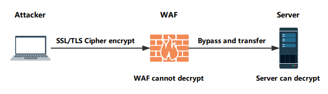
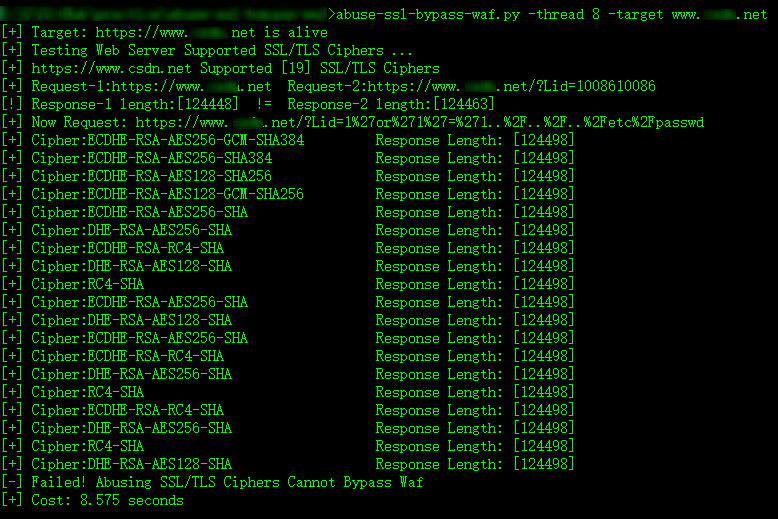
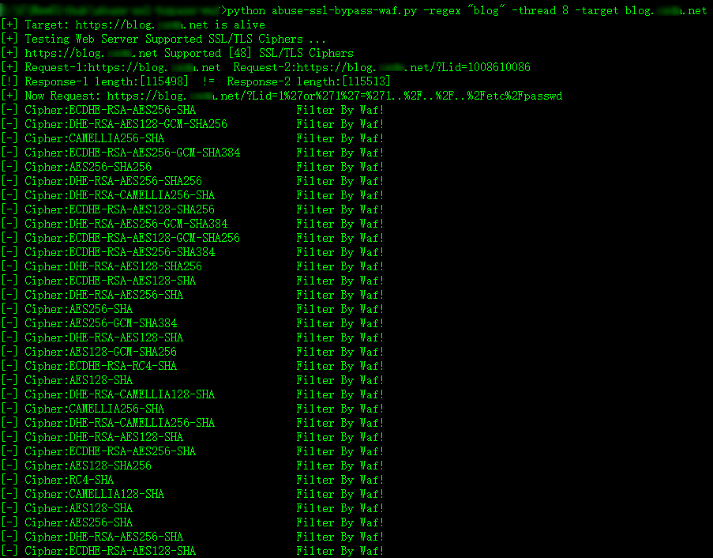
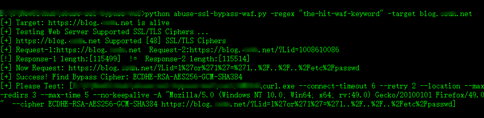

# abuse-ssl-bypass-waf

**Helping you find the SSL/TLS Cipher that WAF cannot decrypt and Server can decrypt same time**

Referer article: [Bypassing Web-Application Firewalls by abusing SSL/TLS](https://0x09al.github.io/waf/bypass/ssl/2018/07/02/web-application-firewall-bypass.html)

#### Idea

#### Usage

`python abuse-ssl-bypass-waf.py --help`

If you can find keyword or regex when hit the WAF page, you can use:

`python abuse-ssl-bypass-waf.py -regex "regex" -target https://target.com`

or you cannot find keyword or regex when filter by WAF,you can use:

`python abuse-ssl-bypass-waf.py -thread 4 -target https://target.com`

**Notice**: If you are worry about WAF drop the connection, you have better not use `-thread` option.

#### Thirdparty

**curl**

**sslcan**

**Notice**: If your operation system is not Windows, you should be modify `config.py` ，adjust `curl`  and `sslscan` path & command values.

#### Running

**If you don't know what the type of the WAF, you can compare the html response content length and try to find the bypassing WAF ciphers**

**knowing the hit WAF page keyword or regex:**

**When using some SSL/TLS ciphers request the payload URL, If WAF keyword or regex not in html page, there is a way bypassing WAF using Cipher!**

